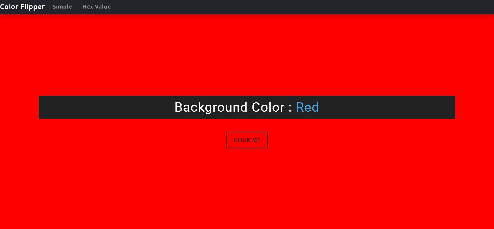

# Color_Flipper

A simple Color Flipper website made using HTML + CSS + JavaScript.This is a simple project made using Vanilla Javascript , as the user will click on 
the button the webiste will change color and that color code will be displayed.Everytime a new color with its hex value will be displayed

Screenshots

 
 

Hope You liked my project.
